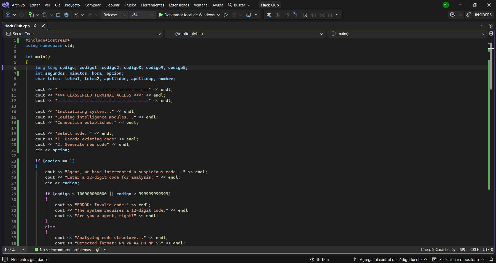
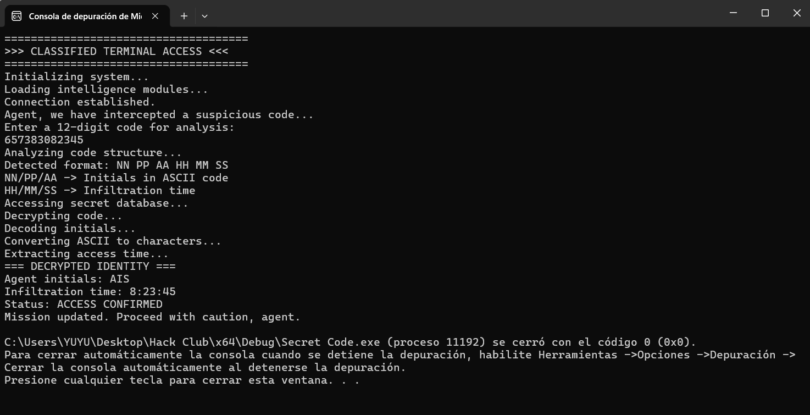

# Secret Code

This project was inspired by the idea of secret identities and undercover agents, similar to *Spy x Family*, where everyday life and hidden missions coexist.

## Overview

**Secret Code** is a C++ program that takes a 12-digit number and interprets it as a classified agent code.

The system simulates a decoding process where:
- Part of the number represents an **infiltration time** (HH:MM:SS)
- Another part is converted from **ASCII values into characters**, forming the agent’s initials

## Update

The program now includes **two working modes**:

### 1. Decode Mode  
Allows the user to enter a 12-digit code and retrieve the hidden information (initials and time).

### 2. Generate Mode  
Allows the user to input data step by step (ASCII values and time), generating a valid code automatically.

This update makes the program more interactive and easier to use, reducing input errors and improving the overall experience.

## How It Works

### Decode Mode
The user enters a 12-digit number.

The program:
1. Splits the number into pairs of digits  
2. Interprets each segment using mathematical operations  
3. Converts ASCII values into characters  
4. Displays the decoded identity and time  

### Generate Mode
The user enters:
- ASCII values (between 65 and 90) for initials  
- Hour, minutes, and seconds  

The program:
1. Builds a valid 12-digit code  
2. Displays the generated code  
3. Shows the agent’s identity 

## Technical Details

- No **strings** are used  
- Everything is handled with **numbers**  
- Uses division and modulo to extract data  
- Applies type conversion to interpret ASCII 